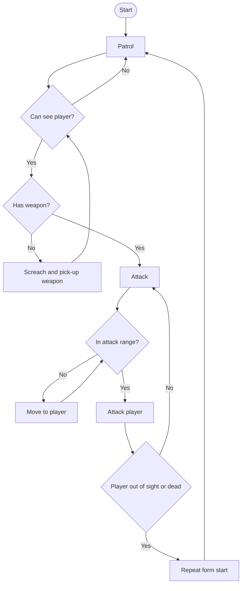

# BT-PCG

HKU assigments for behaviour trees and procedural content generation.

# BT

```mermaid
flowchart TD
    A([Start]) --> B[Patrol]
    B --> C{Can see player?}
    C -->|No| B
    C -->|Yes| D{Has weapon?}
    D -->|No| E[Screach and pick-up weapon]
    E --> C
    D -->|Yes| F[Attack]
    F --> G{In attack range?}
    G -->|No| H[Move to player]
    H --> G
    G -->|Yes| I[Attack player]
    I --> J{Player out of sight or dead}
    J -->|No| F
    J -->|Yes| K[Repeat form start]
    K --> B
```

# PCG
Coming later